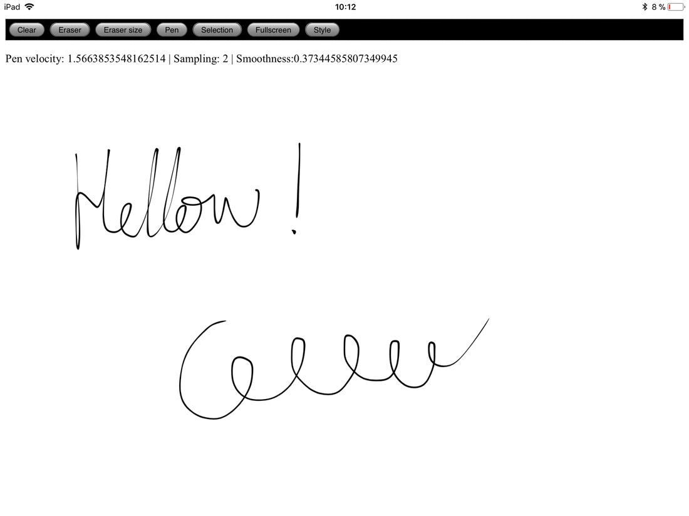
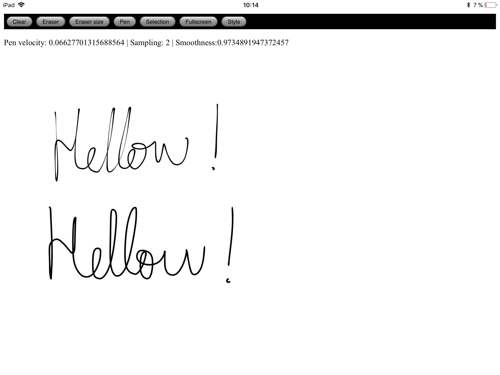

WBoardJS
==========

A JavaScript whiteboard webapp embeeded into a Django app to do handwritting in a similar fashion of Notes Plus (IOS app).  Some features implemented are, stroke thinning (emulating handwriting), partial stroke deletion, selection of text by surrounding it with a stroke and selected text movement and deletion.

>**Note:** Currently only works locally but the idea is to make it shared so users can concurrently write on it using websockets . The server side would be implemented in Django.

Snapshots
---------------

Handwriting emulation     |  Text selection and movement             |
------------------------- |------------------------------------------|
|  |

Set up
------------------
>**Note:** It is recommended to use a virtual environment using *virtualenv* software.
#### Commands
Assuming *virtualenv* is installed, the list of commands to run the app are:

    virtualenv venv_wboardjs
    cd venv_wboardjs
    source bin/activate
    pip install django==1.10
    cd wboardjs
    python manage.py runserver [ip]:[port]

#### Dependencies

- python-django == 1.10

> **Note**: It has only been tested with version 1.10 so there is no guarantee it is forward/backward compatible.

 Contact
-------------
For any comment, doubt or issue write to <eduradical951@gmail.com>.

